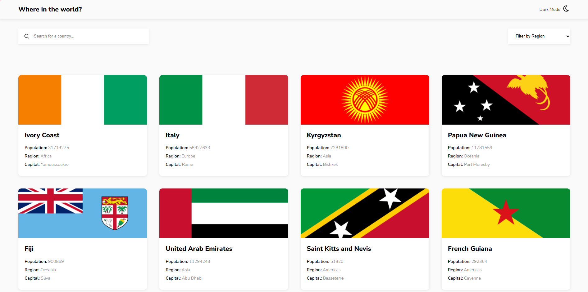
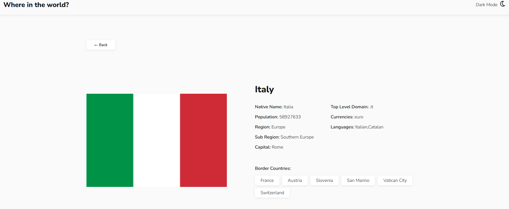
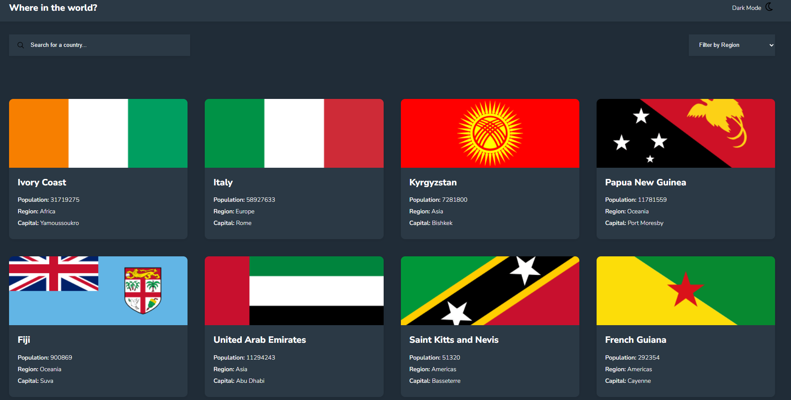
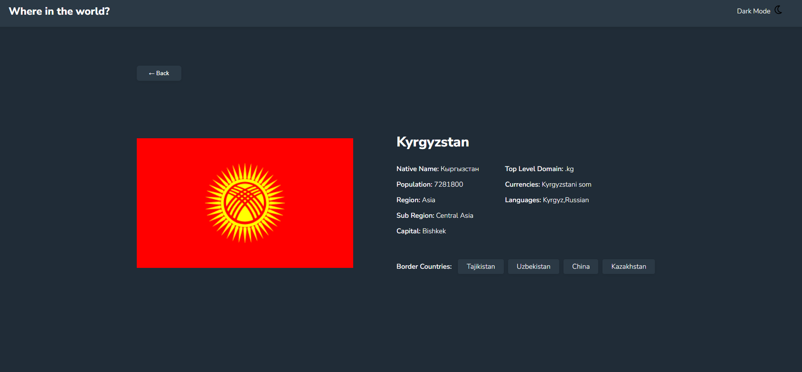
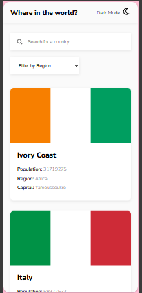

# REST Countries API with color theme switcher

This is a solution to the Frontend Mentor REST Countries API Challenge.

It is a responsive web applicaiton and allows user to explore the countries, search, filter and view the detailed informaiton about the countries. User can toggle detailed information with a light/dark mode toggle. 

## Overview

This project is fully responsive Country explorer application that integrate with the REST Countries API.
It allows user to search and filter countries, view detailed information, and toggle between light and dark modes

### The challenge

Users should be able to:

- See all countries from the API on the homepage
- Search for a country using an `input` field
- Filter countries by region
- Click on a country to see more detailed information on a separate page
- Click through to the border countries on the detail page
- Toggle the color scheme between light and dark mode *(optional)*

### Screenshot

Main page:

Detailed Page:

Main Page (dark mode)

Detailed Page(dark mode)

Mobile

### Links

- Solution URL: 
  [GitHub Repo] https://github.com/srilatha2012/rest-countries-api-with-color-theme-switcher.git
- Live Site URL: 
[Live Demo- Netlify] https://vocal-cassata-e4075d.netlify.app/index.html

## My process

### Built with

- HTML5
- CSS (Flexbox & Grid)
- TypeScript (ES Module)
- REST Countries API
- Responsive Design with media queries

### Approach
 - Used Flexbox for simple one-row layouts like the header and detailed card
 - Used Grid for the Country cards on the home page
 - Fetched Country data from the REST Countries API
 - Converted raw API data into structured TypeScript interface
 - Used map() to prepare data to display
 - Used one filterCountries() function to handle both search and region filtering
 - Used query parameters to pass the country name to the detailed page
 - Used DOM event listeners for country card clicks, back button behaviour, and dark mode toggle
 - Added responsive styles for Desktop, tablet, and mobile version
 
### What I learned
 - Flexbox useful for simple row layouts, and Grid works well for card layouts
 - TypeScript interfaces help describe API data 
 - Optional chaining and fallback values help prevent the errors when API fields are missing
 - import type is useful when importing only interfaces or types
 - encodeURIComponent() helps safly pass country names in the URL
 - URLSearchParams help read values from the URL
 - One combined filter function is better than seperate search and region filter functions
 - TypeScript sometimes complian about element is null we sould handle that element is not null
 - Responsive design depends on layout tools like Flexbox, Grid, and media quries, not only font units like rem
 - Dark mode can be implemented by toggling a class on the body
 - for live deployment used https://www.netlify.com/

 ### Challenges
  - understanding how to structure API data in TypeScript
  - Deciding when to use interfaces instead of classes
  - Handling missing data from the API safely
  - Making the layout responsive for different screens
  - compiling TypeScript and keeping files updated during the development

### Continued development
- Improve dark mode by saving user preferences using local storage
- Add better UI

### Useful resources, tools and commands 
 - `npx tsc`  to compile typescript 
 - `npx tsc` --watch to automatically recompile on file changes
 - `npm run build`  - Runs the build script defined in package.json
 - `npm run watch`  - Runs the watch script defined in package.json

## Deployment
I integrated GigHub with Netlify for continuos deployment. Every push to the main branch in GitHub automatically triggers a new production build.  

## Author
- Name: Srilatha Puppala
- GitHub: https://github.com/srilatha2012  

## Acknowledgments
- Frontend Mentor for the the challenge, design, and files
- REST Countries API for providing country data

## Reflection
In this project I built a REST Countries application using TypeScript, HTML, and CSS.
My main goal was to fetch country data from an API and display it in a clean and user friendly way.
I also added features like search, filter by region, dark mode, and a detailed country page.

During development, I faced few challenges. One challenge was handling API data and converting into TypeScript interfaces. At first I was confused because API response had many nested objects. I solved this by carefully mapping only the requested fields and using optional chaining and default values like "N/A".

Another challenge was working with Typescript null checks. Sometimes, TypeScript showed errors even after I checked for null values. I learned how to handle this using proper checks and non null asertion operator

I also had some layout issues while designing the detailed page. the content was not aligned properly. I fixed by adjusting CSS flexbox and spacing

if I improve this project in the future, better error messages, improve UI design and use locla storage to save theme

Overall, this project helped me understand API handling, TypeScript, DOM manipulaiton better.
